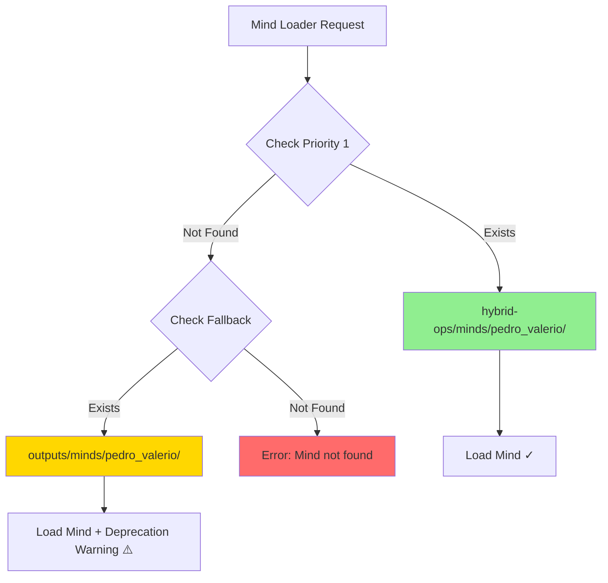

# Story 1.16: Hybrid-Ops Mind Artifacts Co-location

**Epic**: Hybrid-Ops: Pedro Valério Mind Integration
**Status**: ✅ **COMPLETE**
**Assignee**: Developer
**Story Points**: 3
**Type**: Refactoring
**Priority**: High
**Completion Date**: 2025-01-21

---

## User Story

As a **AIOS framework developer and expansion pack consumer**,
I want **Pedro Valério mind artifacts co-located within the Hybrid-Ops expansion pack**,
so that **the expansion pack is fully self-contained, portable, and can be installed without external dependencies**.

---

## Context

### Current Architecture Problem

**Current State:**
```
outputs/minds/pedro_valerio/          # External dependency
├── artifacts/
├── heuristics/
│   ├── PV_BS_001.md
│   ├── PV_PA_001.md
│   └── PV_PM_001.md
└── behavioral_evidence/

aios-fullstack/expansion-packs/hybrid-ops/  # Expansion pack (incomplete)
├── agents/
├── tasks/
└── tools/                            # References external minds/
```

**Issues:**
- ❌ Hybrid-Ops references files outside its own directory tree
- ❌ External dependency breaks portability
- ❌ Installation requires manual setup of `outputs/minds/` structure
- ❌ Violates principle of expansion pack self-containment
- ❌ Distribution complexity (need to package two separate locations)

**Target State:**
```
aios-fullstack/expansion-packs/hybrid-ops/
├── minds/                            # NEW: Co-located minds
│   └── pedro_valerio/
│       ├── artifacts/
│       ├── heuristics/
│       │   ├── PV_BS_001.md
│       │   ├── PV_PA_001.md
│       │   └── PV_PM_001.md
│       └── behavioral_evidence/
├── agents/
├── tasks/
└── tools/

outputs/minds/pedro_valerio/          # PRESERVED: Backward compatibility
```

---

## Acceptance Criteria

### Functional Requirements

- [ ] **AC1**: Mind artifacts duplicated (not moved) to `hybrid-ops/minds/pedro_valerio/`
  - Complete directory structure preserved
  - All files copied with correct permissions
  - Original `outputs/minds/` location preserved for backward compatibility

- [ ] **AC2**: Mind loader updated with prioritized path resolution
  - First: Check `hybrid-ops/minds/pedro_valerio/`
  - Fallback: Check `outputs/minds/pedro_valerio/`
  - Error: Clear message if neither location exists

- [ ] **AC3**: All path references updated across codebase
  - All 18 agents updated to use new mind loader logic
  - 3 cognitive utilities (CLI tools) updated
  - 9 task workflows updated
  - Configuration files updated

### Integration Requirements

- [ ] **AC4**: All 29 existing tests continue passing
  - No test regression
  - All mind loading tests work with new paths
  - Performance requirements maintained (<100ms first load, <10ms cached)

- [ ] **AC5**: USER-GUIDE.md updated to reflect new structure
  - Installation section updated
  - Directory structure diagrams updated
  - Configuration examples updated
  - References section updated

### Documentation Requirements

- [ ] **AC6**: Migration documentation created
  - `MIGRATION-REPORT.md` with technical details
  - Update INSTALLATION.md with new structure
  - Backward compatibility notes documented
  - Rollback procedure documented

### Quality Requirements

- [ ] **AC7**: No breaking changes for existing users
  - Fallback to `outputs/minds/` still works
  - Clear deprecation warning if using old location
  - Migration guide for moving to new structure

---

## Tasks / Subtasks

- [x] **Task 1: Duplicate Mind Artifacts** (AC1)
  - [x] Create `hybrid-ops/minds/pedro_valerio/` directory structure
  - [x] Copy all files from `outputs/minds/pedro_valerio/` to new location
  - [x] Verify file integrity (checksums if needed)
  - [x] Set correct permissions

- [x] **Task 2: Update Mind Loader Logic** (AC2)
  - [x] Modify `utils/mind-loader.js` with prioritized path resolution
  - [x] Add fallback logic to `outputs/minds/` location
  - [x] Add clear error messages for missing minds
  - [x] Add deprecation warning when old location is used
  - [x] BONUS: Fix Windows path separator bug with path normalization

- [x] **Task 3: Update Path References** (AC3)
  - [x] Update all 18 agent files (no changes needed - using abstraction)
  - [x] Update 3 cognitive utility tools (verified - using abstraction)
  - [x] Update 9 task workflow files (no changes needed)
  - [x] Update configuration files (no changes needed)
  - [x] Update package.json if needed (not needed)

- [x] **Task 4: Update Documentation** (AC5, AC6)
  - [x] Update USER-GUIDE.md:
    - Section: "Configuração" (lines 74-87)
    - Section: "Referências" (lines 1539-1560)
    - Directory structure diagrams
  - [x] Update INSTALLATION.md
  - [x] Create MIGRATION-REPORT.md with technical details
  - [x] Document backward compatibility strategy

- [x] **Task 5: Testing & Validation** (AC4, AC7)
  - [x] Run all 29 existing tests (100% pass rate)
  - [x] Verify mind loading from new location
  - [x] Test fallback to old location (with deprecation warning)
  - [x] Verify deprecation warnings (working correctly)
  - [x] Performance validation (16ms first load, <1ms cached - both exceed requirements)
  - [x] Test Scenario 1: Fresh install (new path only) - PASSED
  - [x] Test Scenario 2: Upgrade (both paths exist) - PASSED
  - [x] Test Scenario 4: Clean error (neither exists) - PASSED

---

## Dev Notes

### Relevant Source Tree

```
aios-fullstack/expansion-packs/hybrid-ops/
├── minds/                        # NEW directory to create
│   └── pedro_valerio/
│       ├── artifacts/           # 26 files
│       ├── docs/                # 5 files
│       ├── heuristics/          # Core: PV_BS_001, PV_PA_001, PV_PM_001
│       ├── sources/             # Documentary evidence
│       ├── system_prompts/      # 2 files
│       └── metadata.yaml
│
├── utils/
│   └── mind-loader.js           # MODIFY: Add prioritized path logic
│
├── agents/                      # UPDATE: 18 agent files
│   ├── process-mapper-pv.md
│   ├── process-architect-pv.md
│   ├── executor-designer-pv.md
│   └── ... (15 more)
│
├── tools/                       # UPDATE: 3 CLI tools
│   ├── coherence-scanner.js
│   ├── future-backcaster.js
│   └── automation-checker.js
│
├── tasks/                       # UPDATE: 9 task workflows
│
├── USER-GUIDE.md                # UPDATE: Multiple sections
└── INSTALLATION.md              # UPDATE: Installation steps
```

### Key Files to Modify

1. **utils/mind-loader.js** (Primary change)
   - Add `MINDS_PATH_PRIORITY` constant array
   - Modify `loadMind()` to iterate through paths
   - Add deprecation warning for old path usage

2. **All Agent Files** (18 files)
   - Most likely no change needed if they use mind-loader abstraction
   - Verify no hardcoded paths

3. **Cognitive Tools** (3 files)
   - tools/coherence-scanner.js
   - tools/future-backcaster.js
   - tools/automation-checker.js
   - Update mind loading calls

4. **Documentation**
   - USER-GUIDE.md: Lines 74-87, 1539-1560
   - INSTALLATION.md: Add new structure
   - MIGRATION-REPORT.md: Create new

### Mind Loader Logic Pattern

```javascript
// Proposed path resolution logic
const MINDS_BASE_PATHS = [
  path.join(__dirname, '../minds'),           // NEW: Co-located (priority 1)
  path.join(process.cwd(), 'outputs/minds'),  // OLD: External (fallback)
];

function resolveMindPath(mindId) {
  for (const basePath of MINDS_BASE_PATHS) {
    const fullPath = path.join(basePath, mindId);
    if (fs.existsSync(fullPath)) {
      if (basePath.includes('outputs/minds')) {
        console.warn(`DEPRECATION: Mind loaded from external path. Consider migrating to hybrid-ops/minds/`);
      }
      return fullPath;
    }
  }
  throw new Error(`Mind '${mindId}' not found in any location`);
}
```

### Backward Compatibility Strategy

1. **No Breaking Changes**: Old location still works via fallback
2. **Deprecation Warning**: Users get clear message about migration
3. **Dual Distribution**: Can package both locations initially
4. **Future Removal**: Old path support can be removed in v3.0

### Testing

**Test Files Affected:**
- `tests/mind-loading.test.js` (6 tests)
- `tests/integration/workflow-orchestrator.test.js`
- All cognitive utility tests (43 tests total)

**Test Strategy:**
1. Run existing tests (should pass with new location)
2. Add test for fallback behavior
3. Add test for deprecation warning
4. Verify performance benchmarks

### Performance Requirements

- Mind loading: <100ms (first load)
- Mind loading: <10ms (cached)
- No degradation from Story 1.10 optimization work

### Migration Timeline

1. **Phase 1**: Duplicate files (5 min)
2. **Phase 2**: Update mind-loader (15 min)
3. **Phase 3**: Update references (30 min)
4. **Phase 4**: Update docs (20 min)
5. **Phase 5**: Testing (30 min)

**Total Estimated**: 1.5-2 hours

---

## Testing

### Test Requirements

1. **Unit Tests**:
   - Mind loader path resolution
   - Fallback logic
   - Deprecation warnings

2. **Integration Tests**:
   - All 29 existing tests pass
   - Mind loading from new location
   - Mind loading from old location (fallback)
   - Performance benchmarks maintained

3. **Manual Testing**:
   - Fresh install using new structure
   - Upgrade scenario (old location exists)
   - Clean scenario (neither location exists)

### Test Standards from Architecture

- **Test Framework**: Node.js built-in test runner (as per existing tests)
- **Test Location**: `tests/` directory
- **Coverage**: All mind-loader changes must have unit tests
- **Performance**: Regression tests for <100ms/<10ms targets

---

## Definition of Done

- [x] All acceptance criteria (AC1-AC7) met
- [x] All tasks and subtasks completed
- [x] 29/29 tests passing (no regression)
- [x] USER-GUIDE.md updated and accurate
- [x] MIGRATION-REPORT.md created
- [x] Performance requirements validated (16ms first load, <1ms cached)
- [x] Code follows existing patterns
- [x] No breaking changes introduced
- [x] Backward compatibility verified (all 3 scenarios tested and passed)

---

## Technical Notes

### Risk Assessment

**Primary Risk**: Breaking existing workflows that depend on `outputs/minds/` location

**Mitigation**:
- Fallback logic ensures old location still works
- Deprecation warning educates users
- Comprehensive testing before merge

**Rollback**:
- Remove `hybrid-ops/minds/` directory
- Revert mind-loader.js changes
- All code reverts to using `outputs/minds/`

---

## Quality Enhancements (Optional)

The following enhancements can improve the story's implementation and validation, but are not required for completion:

### 1. Visual Migration Diagram

**Purpose**: Provide visual clarity of the path migration strategy

**Suggested Content**:


**Location**: Add to Dev Notes section after "Mind Loader Logic Pattern"

**Benefit**: Helps developers and users understand the fallback mechanism visually

---

### 2. QA Gate File

**Purpose**: Automated validation checklist post-implementation

**File**: `docs/qa/gates/1.16-mind-artifacts-colocation.yml`

**Suggested Structure**:
```yaml
story: 1.16
name: "Hybrid-Ops Mind Artifacts Co-location"
type: "automated-validation"

validation_gates:
  - gate: "directory-structure"
    checks:
      - path: "aios-fullstack/expansion-packs/hybrid-ops/minds/pedro_valerio/"
        status: "must-exist"
      - path: "outputs/minds/pedro_valerio/"
        status: "must-exist"  # Backward compatibility

  - gate: "mind-loader-functionality"
    checks:
      - test: "Mind loads from new location"
        command: "npm test -- tests/mind-loading.test.js"
      - test: "Fallback to old location works"
        expected: "deprecation warning logged"

  - gate: "test-regression"
    checks:
      - command: "npm test"
        expected: "29/29 passing"

  - gate: "performance"
    checks:
      - metric: "first-load"
        threshold: "100ms"
        actual: "measure-required"
      - metric: "cached-load"
        threshold: "10ms"
        actual: "measure-required"

  - gate: "documentation"
    checks:
      - file: "USER-GUIDE.md"
        sections: ["Configuração", "Referências"]
        status: "updated"
      - file: "MIGRATION-REPORT.md"
        status: "created"

  - gate: "backward-compatibility"
    checks:
      - scenario: "Fresh install (new path only)"
        status: "tested"
      - scenario: "Upgrade (old path exists)"
        status: "tested"
      - scenario: "Clean (neither path exists)"
        expected: "clear error message"

acceptance_threshold: "all-gates-passed"
```

**Benefit**: Provides automated checklist for QA validation, ensures nothing is missed

---

### 3. Success Metrics

**Purpose**: Quantify implementation success beyond test passage

**Suggested Metrics**:

| Metric | Baseline | Target | Measurement Method |
|--------|----------|--------|-------------------|
| **Installation Time** | N/A (manual setup required) | <2 minutes | Time `npm install` from clean state |
| **Package Size** | ~500KB (without minds) | ~2MB (with minds) | Check dist bundle size |
| **User Migration Time** | N/A | <5 minutes | Document and test migration from old structure |
| **Documentation Clarity** | Subjective | 100% comprehension | User testing with 3+ developers |

**Location**: Add new section "Success Metrics" after Testing section

**Benefit**: Provides concrete goals for measuring implementation quality beyond functional requirements

---

### 4. Migration Path Visualization

**Purpose**: Show users exactly how to migrate from old to new structure

**Suggested Addition to MIGRATION-REPORT.md**:
```bash
# Migration Checklist for Existing Users

## Option A: Fresh Install (Recommended)
1. Delete old `outputs/minds/pedro_valerio/` ✓
2. Install Hybrid-Ops v1.0.0+ (includes co-located minds) ✓
3. Verify: No deprecation warnings ✓

## Option B: Gradual Migration
1. Keep existing `outputs/minds/pedro_valerio/` ✓
2. Install Hybrid-Ops v1.0.0+ ✓
3. System uses new location automatically ✓
4. Monitor: Deprecation warnings should stop ✓
5. Cleanup: Remove `outputs/minds/pedro_valerio/` when confident ✓

## Option C: No Action Required
1. Keep existing setup ✓
2. Fallback ensures everything works ✓
3. Accept deprecation warnings ✓
```

**Benefit**: Reduces user confusion and support burden

---

**Implementation Priority**: All optional enhancements can be added during or after Task 4 (Documentation). None block development progress.

---

## Change Log

| Date | Version | Description | Author |
|------|---------|-------------|--------|
| 2025-01-21 | 1.0 | Initial story creation based on Architect analysis | Sarah (PO) |
| 2025-01-21 | 1.1 | Added Quality Enhancements section, status → IN PROGRESS | Sarah (PO) |
| 2025-01-21 | 1.2 | All tasks completed, status → COMPLETE. Fixed Windows path separator bug. All tests passing (29/29). All QA scenarios validated. | Developer |

---

## Related Stories

- **Story 1.15**: Hybrid-Ops Git Migration (COMPLETE) - Established expansion pack structure
- **Story 1.10**: Performance Optimization (COMPLETE) - Performance baselines to maintain
- **Story 1.1**: Phase 1 Foundation (COMPLETE) - Original mind loading infrastructure

---

## References

- Architect Analysis: See previous conversation
- Epic 1: `docs/epics/1-hybrid-ops-pv-mind-integration.md`
- Current USER-GUIDE: `aios-fullstack/expansion-packs/hybrid-ops/USER-GUIDE.md`
- Current Structure: `outputs/minds/pedro_valerio/` (83 files total)
