# Epic 6.1: Agent Identity System - Stories Index

**Master Index:** [README.md](README.md) ← All AIOS 2.0 Stories
**Epic:** [Epic 6.1 - Agent Identity System](../../epics/epic-6.1-agent-identity-system.md)
**Parent:** Epic-Master-AIOS-2.0 (Wave 1)
**Total Investment:** $5,200
**Total Duration:** ~6 weeks
**Status:** 🟢 In Progress

---

## 📊 Stories Overview

| Story | Title | Status | Duration | Investment | Priority |
|-------|-------|--------|----------|------------|----------|
| [6.1.1](story-6.1.1-agent-persona-definitions.md) | Agent Persona Definitions | ✅ DONE (9.5/10) | 2 days | $200 | 🔴 Critical |
| [6.1.2](story-6.1.2.md) | Agent File Updates | 📋 Ready | 3 days | $300 | 🔴 Critical |
| [6.1.2.5](story-6.1.2.5-contextual-agent-load-system.md) | Contextual Agent Load System | 📋 Ready | 3 days | $300 | 🟡 Medium |
| [6.1.6](story-6.1.6-output-formatter-implementation.md) | Output Formatter (Layer 2) | 📋 Ready | 2 days | $200 | 🔴 Critical |
| [6.1.7](story-6.1.7-core-tasks-migration.md) | Core Tasks Migration V2.0 | 📋 Ready | 12 days | $1,200 | 🔴 Critical |
| [6.1.8](story-6.1.8-templates-migration.md) | Templates Migration | 📋 Ready | 2 days | $200 | 🔴 Critical |
| [6.1.9](story-6.1.9-checklists-migration.md) | Checklists Migration | 📋 Ready | 2 days | $200 | 🔴 Critical |
| [6.1.10](story-6.1.10-dependencies-migration.md) | Dependencies & Data Files | 📋 Ready | 1 day | $100 | 🟡 Medium |
| [6.1.11](story-6.1.11-aios-master-tasks.md) | AIOS-Master Meta-Agent Tasks ⭐ | 📋 Ready | 3 days | $300 | 🔴 Critical |
| [6.1.3](story-6.1.3.md) | Create @docs Agent (Ajax) | 📋 Ready | 3 weeks | $2,000 | 🔴 Critical |
| [6.1.4](story-6.1.4.md) | Configuration System | 📋 Ready | 2 days | $200 | 🔴 Critical |
| [6.1.5](story-6.1.5.md) | Testing & Validation | 📋 Ready | 2 days | $200 | 🔴 Critical |

---

## 🔗 Dependency Chain

### Critical Path (Sequential)

```mermaid
graph LR
    A[6.1.1 ✅] --> B[6.1.2 📋]
    B --> C[6.1.6 📋]
    C --> D[6.1.7 📋]
    D --> E[6.1.8 📋]
    E --> F[6.1.9 📋]
    F --> G[6.1.10 📋]
    G --> H[6.1.11 📋]
    H --> I[6.1.3 📋]
```

### Parallel Work Opportunities

#### Wave 1 (After 6.1.2 completes)
- ✅ **Story 6.1.4** (Configuration System) - Can start in parallel with 6.1.6
  - Requires: 6.1.2 only
  - Independent from 6.1.6-6.1.11 chain

#### Wave 2 (After 6.1.7 Phase 1 completes)
- ⚠️ **Story 6.1.7 Phases 2 & 3** can continue while:
  - Story 6.1.8 starts (templates)
  - Story 6.1.4 continues (config system)

#### Wave 3 (After 6.1.4 completes)
- ✅ **Story 6.1.2.5** (Contextual Agent Load System) - UX Enhancement
  - Requires: 6.1.2 (done), 6.1.2.4 (done), 6.1.4
  - Independent from critical path (doesn't block other stories)
  - Can run in parallel with 6.1.6-6.1.11 chain

---

## 📋 Detailed Story Summaries

### ✅ Story 6.1.1: Agent Persona Definitions (DONE)
**Owner:** PM (Morgan) + UX (Uma)
**QA Score:** 9.5/10

**Deliverables:**
- ✅ `docs/agents/persona-definitions.md` (complete documentation)
- ✅ `docs/agents/persona-definitions.yaml` (machine-readable data)
- ✅ 11 archetypes defined (Builder, Guardian, Balancer, Visionary, Flow Master, Architect, Explorer, Empathizer, Engineer, Operator, Orchestrator)

---

### 📋 Story 6.1.2: Agent File Updates
**Owner:** Dev (Dex)
**Blocks:** 6.1.6, 6.1.4

**Scope:** Update 11 agent files with `persona_profile` section

**Agent Updates:**
1. dev.md → Dex (Builder, ♒ Aquarius)
2. qa.md → Quinn (Guardian, ♍ Virgo)
3. po.md → Pax (Balancer, ♎ Libra)
4. pm.md → Morgan (Visionary, ♐ Sagittarius)
5. sm.md → River (Flow Master, ♊ Gemini)
6. architect.md → Aria (Architect, ♑ Capricorn)
7. analyst.md → Atlas (Explorer, ♉ Taurus)
8. ux-design-expert.md → Uma (Empathizer, ♓ Pisces)
9. db-sage.md → data-engineer.md (Dara - Engineer, ♉ Taurus)
10. github-devops.md → devops.md (Gage - Operator, ♈ Aries)
11. aios-developer + aios-orchestrator → aios-master.md (Orion - Orchestrator, ♌ Leo)

---

### 📋 Story 6.1.6: Output Formatter Implementation (Layer 2)
**Owner:** Dev (Dex)
**Requires:** 6.1.2
**Blocks:** 6.1.7

**Deliverables:**
- `.aios-core/scripts/output-formatter.js` (PersonalizedOutputFormatter class)
- `.aios-core/scripts/validate-output-pattern.js` (Pattern validator)
- `.aios-core/templates/task-execution-report.md` (Standardized template)
- 50+ unit tests
- Integration test with 1 task

**Philosophy:** "Structure is sacred. Tone is flexible."

---

### 📋 Story 6.1.7: Core Tasks Migration to V2.0
**Owner:** Dev (Dex) + All Agents
**Requires:** 6.1.6
**Blocks:** 6.1.8, 6.1.11

**Scope:** Migrate 104 tasks across 3 phases

**Phases:**
- **Phase 1:** 15 Core Critical Tasks (3 days, $300)
- **Phase 2:** 50 Agent-Specific Tasks (5 days, $500)
- **Phase 3:** 39 Utility & Support Tasks (4 days, $400)

**Key Changes:**
- Execution Modes (YOLO/Interactive/Pre-Flight)
- Restructured Checklists (pre/post/acceptance)
- Tools vs Scripts distinction
- Error Handling strategies
- Performance Metrics
- output-formatter.js integration

---

### 📋 Story 6.1.8: Templates Migration
**Owner:** Dev (Dex) + Architect (Aria)
**Requires:** 6.1.7
**Blocks:** 6.1.9

**Scope:** Update 15+ templates with personality injection slots

**Changes:** Add `{agent.name}`, `{archetype}`, `{signature_closing}` placeholders

**Templates:**
- Story & Epic templates
- Architecture templates
- Documentation templates
- Technical templates (QA, migration, etc.)

---

### 📋 Story 6.1.9: Checklists Migration
**Owner:** QA (Quinn) + Dev (Dex)
**Requires:** 6.1.8
**Blocks:** 6.1.10

**Scope:** Add agent-specific guidance to 10+ checklists

**Changes:**
- Agent-Specific Guidance sections
- Personalized Failure Protocols
- Archetype-based Recommendations
- Agent Notes with vocabulary matching

---

### 📋 Story 6.1.10: Dependencies & Data Files Migration
**Owner:** Architect (Aria)
**Requires:** 6.1.9
**Blocks:** 6.1.11

**Key Deliverable:** `.aios-core/data/archetype-vocabulary.yaml`

**Content:**
- 11 archetypes with 5-10 PT-BR verbs each
- avoid_words for each archetype
- emoji_palette for each archetype
- emotional_signature for each archetype

---

### 📋 Story 6.1.11: AIOS-Master Meta-Agent Tasks ⭐
**Owner:** AIOS-Master (Orion) + Dev (Dex) + Architect (Aria)
**Requires:** 6.1.10, 6.1.7, 6.1.2
**Blocks:** 6.1.3

**4 Critical Tasks:**
1. `explain-architecture.md` - Explain 3-layer personalization system
2. `create-new-agent.md` - Create new agents with persona system
3. `modify-existing-agent.md` - Safely modify existing agents
4. `audit-system-consistency.md` - Audit system-wide compliance

**Why Critical:** Enables Story 6.1.3 to use `create-new-agent` task for @docs agent creation

---

### 📋 Story 6.1.3: Create @docs Agent (Ajax)
**Owner:** Dev (Dex) + Architect (Aria)
**Requires:** 6.1.1, 6.1.11
**Blocks:** Epic 14 (Partner Onboarding)

**Implementation:**
- **Week 1:** Agent Build ($1,000) - 6 tasks, 5 templates
- **Week 2:** Wave 4 Preparation ($700) - Partner training docs (12+ files)
- **Week 3:** Integration & Automation ($300) - Git hooks, CI/CD

**Approach:** Use aios-master's `create-new-agent` task to systematically create @docs agent

**ROI:** +$83,200 (3-year net benefit from documentation automation)

---

### 📋 Story 6.1.4: Configuration System
**Owner:** Dev (Dex)
**Requires:** 6.1.2

**Implementation:**
- Update `core-config.yaml` with `agentIdentity` section
- 3-level personification system (Minimal, Named, Archetypal)
- CLI commands: `aios config set/get agentIdentity.level`
- Greeting logic for all 3 levels

---

### 📋 Story 6.1.2.5: Contextual Agent Load System (UX Enhancement)
**Owner:** Dev (Dex)
**Requires:** 6.1.2, 6.1.2.4, 6.1.4
**Architecture Review:** ✅ Approved by @architect (2025-01-15)

**Scope:** Intelligent agent greeting system that adapts based on session context

**Implementation (3 days, $300):**
- **Day 1:** Context detection (hybrid: conversation + file-based)
- **Day 2:** Greeting builder + command categorization (11 agents)
- **Day 3:** Testing + performance optimization (150ms hard limit)

**Key Components:**
- `context-detector.js` - Session type detection (new/existing/workflow)
- `git-config-detector.js` - Cached git config (5min TTL)
- `greeting-builder.js` - Assemble contextual greeting
- `workflow-patterns.yaml` - Hardcoded workflow definitions

**Deliverables:**
- 3 new scripts (detection + caching + builder)
- Command visibility metadata in 11 agent files
- Updated core-config.yaml schema (agentIdentity.greeting + git)
- Performance benchmarks (P50 <100ms, P95 <130ms, P99 <150ms)

**Architecture Reference:** `docs/architecture/architectural-review-contextual-agent-load.md`

**Why Medium Priority:** UX enhancement that doesn't block critical path but significantly improves user experience

---

### 📋 Story 6.1.5: Testing & Validation
**Owner:** QA (Quinn) + All Agents
**Requires:** All previous stories complete

**Tests:**
- Unit Tests (persona validation, greeting logic)
- Integration Tests (agent activation at all 3 levels)
- User Acceptance Tests (20 beta users, 4.5/5 target)
- Localization Compatibility (EN + PT-BR)
- Backward Compatibility (all existing workflows)

---

## 📈 Success Metrics

### Launch Criteria
- ✅ All 11 agents have complete personas
- ✅ 3 personification levels functional
- ✅ Configuration system working
- ✅ Beta testing: 20 users, 4.5/5 stars
- ✅ Zero breaking changes

### Adoption Metrics (6 months post-launch)
- ✅ 80%+ users keep Level 2 (Named) as default
- ✅ +30% task completion rate
- ✅ NPS increase of +10 points

---

## ⚡ Quick Links

- **Epic:** [Epic 6.1 - Agent Identity System](../../epics/epic-6.1-agent-identity-system.md)
- **Standards:** [Agent Personalization Standard V1.0](../../standards/AGENT-PERSONALIZATION-STANDARD-V1.md)
- **Standards:** [Task Format Specification V1.0](../../standards/TASK-FORMAT-SPECIFICATION-V1.md)
- **Decisions:** [DECISION-2 - Agent Personalization Implementation](../../decisions/DECISION-2-AGENT-PERSONALIZATION-IMPLEMENTATION.md)
- **Architecture:** [Contextual Agent Load System Review](../../architecture/architectural-review-contextual-agent-load.md)
- **Templates:** [Personalized Agent Template](../../../.aios-core/templates/personalized-agent-template.md)
- **Templates:** [Personalized Task Template V2.0](../../../.aios-core/templates/personalized-task-template-v2.md)

---

**Last Updated:** 2025-01-15
**Maintained by:** Product Owner (Pax)
**Recent Changes:**
- Added Story 6.1.2.5 (Contextual Agent Load System) - $300, 3 days
- Total Investment updated: $4,900 → $5,200
